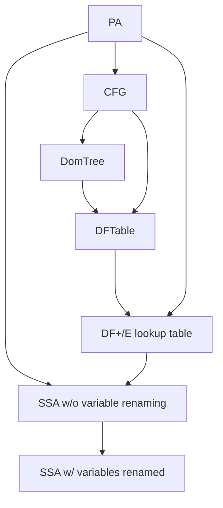

# 50.054 Project Lab 3 (15%)

In the previous lab, we completed the big step operational semantics and type inference for SIMP program.

If you have trouble completing lab 2, you can send the instructor an email to ask for the sample solution. 

In this lab, we look into the name analysis, liveness analysis and target code generation of the SIMP language.

## Tasks for this Lab

The three main tasks for this lab include

1. Implementing the algorithm that constructs an SSA form from a Psuedo Assembly program.
1. Implementing the liveness analysis for Psuedo Assembly Programs
1. Implementing the JVM bytecode generator for Psuedo Assembly Programs 

There is no obvious dependency between the two tasks, hence you can divide the task among your team members if you wish to.


## Prelude 

To migrate from your lab 1 and lab 2 answers to this project, 
You should copy the `.scala` files that have been modified by you and overwrite those counterparts in this project template, (the ones being overwritten should be the same as those found in the lab 1 and lab 2 project template.)


The given project template contains the following new files/folders comparted to lab 1 and lab 2 project template.

* `src/main/scala/sutd/compiler/simp/backend` - the folder for the JVM bytecode backend
* `src/main/scala/sutd/compiler/simp/ir` - contains the following new files
    * `CFG.scala` - the CFG construction module
    * `DF.scala` - the Dominance Frontier construction module
    * `SSA.scala` - the SSA construction module
* `src/main/scala/sutd/compiler/simp/lattice/` - contains the modules for Lattice operations
* `src/main/scala/sutd/compiler/simp/monad/error/` - contains the additional monad error instances
* `src/main/scala/sutd/compiler/simp/semantic/` - contains the following new files
    * `LivenessAnalysis.scala`  the liveness analysis module (which should be completed in the cohort exercise in week 11)
    * `SignAnalysis.scala` - the sign analysis module
    * `Util.scala` - some utility functions for semantic analysis (and code generation)
* `src/main/scala/Main.scala` - has been modified to accommodate the compiler flag and code generation integration.
* `src/test/scala/sutd/compiler/simp/` - contains the following new test suites
    * `TestCFG.scala`
    * `TestDF.scala`
    * `TestLivenessAnalysis.scala`
    * `TestSignAnalysis.scala`
    * `TestSSA.scala`
* `build.sbt` - has been modified to include the `org.ow2.asm` external dependency which is required for JVM bytecode manipulation.
* `project/plugins.sbt`- is a newly added file, to support the packaging of `org.ow2.asm` dependencies and Scala run-time into a single jar file.


## Task 1 : Constructing SSA (5 marks)

In this task we look into constructing the Static Single Assignment from given a Psuedo Assembly program. 

Recall the flow of constructing of SSA goes as follows



The construction of CFG from PA `CFG.scala` has been implemented, you don't have to update it.
The construction of DomTree from CFG has been given in `DF.scala`

### Sub Task 1.1 

In this sub task, you are supposed to complete the implementation dominance frontier table construction in `DF.scala`. Recall the steps are as follows,

1. traverse the dominator tree in post-order
1. for each vertex, compute the $df_{local}$ and its children's $df_{up}$
    1. union the two components and save it to the table.

You may find the following data structures and functions useful.

* `CFG.scala`
    1. `CFG`
    1. `successors`
* `DF.scala`
    1. `DomTree`
    1. `childOf`
    1. `isChildOf`
    1. `postOrderTrav`

After this sub task, you should be able to pass all the test cases in `TestDF.scala`

### Sub Task 1.2 

In this sub task, you are supposed to complete the implementation of SSA construction in `SSA.scala`.

According to the notes (Cytron's algorithm), there are two steps, 

1. building a Pre-SSA form where phi assignments are inserted to the $DF^+$. 
1. renaming the variables in the a Pre-SSA form.

Step 2 has been implemeneted. Step 1 is incomplete. Fill in the missing parts in `SSA.scala` to complete this step.


You may find the following data structures and functions useful.

* `CFG.scala`
    1. `CFG`
    1. `predecessors`
* `DF.scala`
    1. `DFplus`
* `SSA.scala`
    1. `PhiAssignment`


When you are done, you should be able to pass all the test cases in `TestSSA.scala`


## Task 2 : Liveness Analysis (5 marks)

Recall that liveness analysis aims to discover the set of program variables that may "live", for each program location $l$. 

The idea is 

1. to define the abstract domain of the solution, then
1. to show that the abstract values (as well as the abstract states) are elements from some copmlete lattice.
1. to generate an monotonic equation system (one equation per program location)
    1. each equation defines the relationship between abstract values (from different abstract states, i.e. those arised from adjacent program locations)
    1. re-express the monotonic equation system into a monotone function
1. to apply fixed point algorithm to solve the equation system

For liveness analysis, the abstract states are sets of program variables at each program locations. It is a power set lattice, hence it is a complete lattice. 

The definition of a complete lattice is given as type class `CompleteLattice` (in `CompleteLattice.scala`). The definition of a powerset lattice is given as a type class instance of `CopleteLattice`.


### Sub Task 2.1 

In this task you need to complete the definition of the helper function `join()` in `LivenessAnalysis.scala` to *merge* state objects from the previous states. (Hint, recall that liveness analysis is a backward analysis.) 


### Sub Task 2.2 
In addition, you need to complete the definition of the monotone function, `genMonotonFunction`. Note that the type of monotone function in livenesss analysis is `AbstractEnv => AbstractEnv`, where `AbstractEnv` is a `Map[Label, AbstractState]`. By definition, `AbstractEnv` forms a map lattice.  In this implementation, we generalize the type of the monoetone function to `AbstractEnv => Either[String, AbstractEnv]` to handle error reporting. 

When you are done, you should be able to pass all the test cases in `TestLivenessAnalysis.scala`


## Task 3 : Generating JVM Bytecodes (3 marks)

Though this task can be completed without the first 2 tasks, you are advised to finish the other two tasks before attempting this task. 

In this task, you are required to complete the partially implemented function `convertInstr()`  in `backend/JVM.scala` which emits the JVM bytecode given a PA labeled instruction.

You may find the following function and data structure useful.


* `monad/error/StateTMonadError.scala`
* `monad/error/EitherStringMonadError.scala`
* `JVM.scala`
    1. `convertLabel`
    1. `convertOpr`
    1. `getMV`
* JVM bytecode documentation 
    1. `https://asm.ow2.io/asm4-guide.pdf`  (esp, Appendix A.1.)


There is no test suite defined in scalatest.

When you are done, run

```bash
$ sbt compile
$ sbt test
```
to compile. Then run 

```bash
$ sbt assembly
```
to generate  a mega jar (with all the jvm bytecode depenedencies and Scala run-time library)

To test, run the following with scala version >= 3.7.2

```bash
$ scala run -cp target/scala-3.7.2/simp_all.jar -M sutd.compiler.simp.Main -- -c examples/fib.simp 
```
which prints `Compilation done.` and generate a JVM byte file, `GeneratedClass.class`


```bash 
$ java GeneratedClass 5 
```
which should produce `8`.

You can try and test with some other `.simp` programs in `examples` or your own creation.

Congratulations! You have completed this project! 
Now you can `sbt clean` and zip up your project and submit.


## Task 4: (2 marks)

There is no specific requirement for task 4. You are supposed to propose and implement whatever you like related to the simp compiler.
Your proposal must be related to this compiler. Some ideas could be

1. Build a nice web frontend for Simp. e.g. you can use
    * `https://www.playframework.com/` to write a simple web app that reads the user input as simp source and returns the JVM Bytecode.
    * You may want to further transpile JVM bytecode to wasm, using `https://labs.leaningtech.com/blog/cheerpj-3.0`,  which will be deployed and run in the browser directly.

1.  Better error reporting 
    * Note that there is a `SrcLoc.scala` module being used in the lexer. It keeps track of the current line and column of the parsed/lexed token. In case of error, we can give a more informative message with the source program location. Can you extend the parser, type inference, and other possible analysese to incorporate the source locations? 


If you have any other idea, feel free to propose to the instructor.

